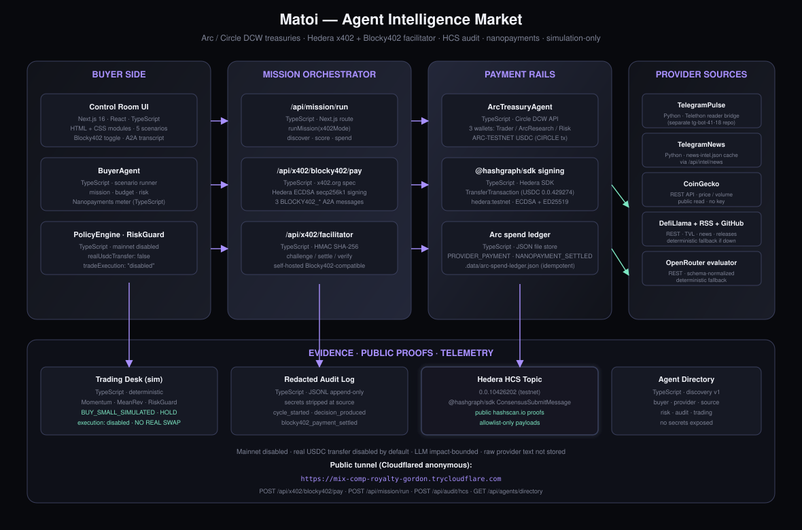

# Matoi — Agent Intelligence Market

> Control room for autonomous economic agents. A buyer arrives with a mission and a budget, discovers provider agents, buys intelligence through Arc/Circle testnet spend authorization, settles x402 receipts on Hedera testnet, and leaves a public proof on HCS. No real trades. No mainnet.

[](https://mix-comp-royalty-gordon.trycloudflare.com)
[](#-verification)
[](#-verification)
[](#-verification)
[](https://nodejs.org)
[](#license)

---

## 🌐 Live demo

| | URL |
|---|---|
| Public tunnel (trycloudflare) | https://mix-comp-royalty-gordon.trycloudflare.com |
| Local (PC 24/7) | http://127.0.0.1:3100 |
| Control room | `/` |
| Product docs | `/docs` |
| Blocky402 paid endpoint | `POST /api/x402/blocky402/pay` |
| Mission runner | `POST /api/mission/run` |
| HCS topic (testnet) | `0.0.10426202` — [hashscan.io](https://hashscan.io/testnet/topic/0.0.10426202) |

The tunnel URL changes every time `cloudflared` restarts (anonymous tunnel). Re-run the deploy command below to regenerate.

---

## 🏆 Tracks

### Arc / Circle — _Best Agentic Economy Application with Circle Agent Stack_ ($3,500)

We exercise the **Circle Developer Controlled Wallets (DCW)** stack on ARC-TESTNET as the programmable **buyer treasury** and **provider payout authorization** layer. The buyer does not just read data — it authorizes bounded testnet spend under a budget and risk policy, and every authorized intent is written to an idempotent local ledger.

Arc/Circle requirement checklist:

| Requirement | Status | Where |
|---|---:|---|
| Functional MVP with working frontend | ✅ | Next.js control room at `/` |
| Working backend | ✅ | `src/app/api/**`, especially `/api/mission/run`, `/api/arc/status`, `/api/arc/authorize-payment` |
| Architecture diagram | ✅ | embedded below + `docs/architecture.svg` |
| Video demonstration + presentation | ⏳ | `DEMO_SCRIPT.md` ready; video link added before final submit |
| Effective use of Circle Developer tools/tech | ✅ | Circle DCW, ARC-TESTNET, USDC, guarded transfer, nanopayments ledger |
| Detailed documentation | ✅ | `docs/ARC_TRACK.md`, `docs/SETUP.md`, `docs/wallets-and-rails.md` |
| GitHub/Replit repo link | ⏳ | public GitHub URL added before final submit |

What we wire up:

- **3 role wallets** (`Trader`, `ArcResearch`, `Risk`) on ARC-TESTNET — one `GET /api/arc/status` away
- **Spend authorization** with `realUsdcTransfer: false` default + gated opt-in for the optional real ARC-TESTNET transfer demo (`POST /api/arc/testnet-transfer/run` with `ARC_REAL_USDC_TRANSFER=true` + `confirmRealTransfer=true`)
- **Real ARC-TESTNET transfer proof** — `CIRCLE tx a0042c1c-ae9a-5120-accc-7116dfc1ec31`, state COMPLETE, masked txHash `f2caec07...4820b9a4`
- **Idempotent provider payout ledger** (`.data/arc-spend-ledger.json`) — `PROVIDER_PAYMENT` + `NANOPAYMENT_SETTLED` entries with replay-safe keys

Full Arc/Circle submission mapping: [docs/ARC_TRACK.md](./docs/ARC_TRACK.md)

### Hedera — _live x402-gated service + real paid request_

We expose a **live x402-gated `POST /api/x402/blocky402/pay` endpoint** on Hedera testnet. A buyer-side orchestrator signs a Hedera HTS USDC `TransferTransaction` locally with `@hashgraph/sdk`, then submits it to our **Blocky402-compatible facilitator** at `/api/x402/blocky402-facilitator/settle`, which returns an HMAC-signed x402 receipt consumed by the BuyerAgent mission flow.

Hedera requirement checklist:

| Requirement | Status | Where |
|---|---:|---|
| Host a live x402-gated service on Hedera testnet/mainnet | ✅ | `POST /api/x402/blocky402/pay` |
| Settle through the Blocky402 facilitator | ✅ | `BLOCKY402_URL=http://127.0.0.1:3100/api/x402/blocky402-facilitator` → `<base>/settle` |
| Build a platform/agent that consumes the service | ✅ | `POST /api/mission/run` with `x402Mode: "blocky402"` |
| Complete at least one real paid request end-to-end | ✅ | verified localhost + public tunnel receipts |
| README covers setup, architecture and payment flow | ✅ | `README.md`, `docs/SETUP.md`, `docs/HEDERA_TRACK.md` |
| Demo video ≤ 5 minutes showing paid request | ⏳ | script ready in `DEMO_SCRIPT.md`; video link added before final submit |

What we wire up:

- **Hedera testnet account `0.0.10380366`** (ECDSA) with `HEDERA_PAYER_KEY` — sign-on-the-spot `TransferTransaction`
- **USDC token `0.0.429274`** (decimals 6) — explicitly associated via `TokenAssociateTransaction` (txHash `0.0.10380366@1789189919.552662668`)
- **Real-time signing** via `src/lib/hedera-payment-signer.ts` using `@hashgraph/sdk`'s `TransferTransaction` → frozen → `privateKey.sign()` → base64-encoded transaction body
- **Self-hosted Blocky402-compatible facilitator** at `/api/x402/blocky402-facilitator/settle` — translates x402-shaped body to `settleX402Payment`, auto-opens a matching challenge when the buyer sends a fresh nonce, then returns a signed receipt
- **Public tunnel serves the endpoint** — judges can run `curl -X POST https://mix-comp-royalty-gordon.trycloudflare.com/api/x402/blocky402/pay ...` from anywhere while the demo PC is online
- **Recent verified paid requests** — localhost `receiptId=x402-d72b519cbeb82c65`, public tunnel `receiptId=x402-44df75b702d9b507`
- **3 Blocky402 A2A messages** appended to mission transcript (`BLOCKY402_CHALLENGE_RECEIVED`, `BLOCKY402_PAYMENT_SUBMITTED`, `BLOCKY402_RECEIPT_VERIFIED`)
- **Audit event** `blocky402_payment_settled` written to local redacted audit log
- **HCS public proof** via `POST /api/audit/hcs` — allowlisted fields only, no secrets

Full Hedera submission mapping: [docs/HEDERA_TRACK.md](./docs/HEDERA_TRACK.md)

---

## 🏗 Architecture



> One-page architecture diagram (SVG, 1180×780). See `docs/architecture.md` for the full mermaid and component table.

**TL;DR:** BuyerAgent → discover provider agents → provider-specific scoring + OpenRouter evaluator → PolicyEngine → Arc/Circle spend authorization → Blocky402 x402 facilitator settles Hedera USDC transfer → nanopayments meter accrues per call → redacted audit log → HCS public proof. No mainnet. No real swaps.

---

## 🧪 What works (verified)

| Layer | Status | Proof |
|---|---|---|
| `npm run lint` | ✅ green | 0 errors |
| `npm run build` | ✅ green | 28/28 static pages |
| `npx vitest run` | ✅ **91 tests passed** | unit + integration |
| `npm run qa:smoke` | ✅ `SMOKE_HTTP_OK` | live HTTP checks |
| `npm run deploy:check` | ✅ pass | readiness preflight |
| Blocky402 paid request (localhost) | ✅ live | receiptId `x402-***` |
| Blocky402 paid request (public tunnel) | ✅ live | judges can run from anywhere |
| Arc/Circle DCW readiness | ✅ 3 wallets | `GET /api/arc/status` |
| ARC-TESTNET real transfer | ✅ proven | CIRCLE tx COMPLETE |
| Hedera testnet signing | ✅ live | ECDSA via `@hashgraph/sdk` |
| Hedera USDC token association | ✅ txHash on chain | `0.0.10380366@1789189919.552662668` |
| Hedera HCS audit | ✅ topic | `0.0.10426202` testnet |
| Nanopayments meter | ✅ per-call | `NANOPAYMENT_SETTLED` ledger |
| OpenRouter live evaluator | ✅ fallback | deterministic when no key |

## ⛔ What we did NOT enable (safety)

- **Mainnet**: every wallet is on `ARC-TESTNET` / `hedera-testnet`
- **Real trades**: `tradeExecution: "disabled"`, no swap calls
- **Real USDC transfer by default**: `realUsdcTransfer: false` (smoke + tests), opt-in via `ARC_REAL_USDC_TRANSFER=true` + `confirmRealTransfer=true` only
- **Raw LLM text**: `rawTextStored: false`
- **Secrets in browser / audit / HCS**: redacted at source, server-side only
- **Phone, telegram ID, .session files**: never committed (`.gitignore`)

---

## 🚀 Setup

Pre-requisites:

| | Min | Tested with |
|---|---|---|
| Node.js | 18.x | 24.x |
| npm | 9.x | 10.x |
| git | 2.30 | 2.46 |
| `cloudflared` | latest | 2026.8.3 (Windows) |

Install + run:

```bash
git clone <this-repo> agent-intelligence-market
cd agent-intelligence-market
npm install
cp .env.example .env.local            # then fill in keys (see docs/SETUP.md)
npm run dev                           # http://127.0.0.1:3100
```

Public tunnel (so judges can hit the paid endpoint from anywhere):

```bash
cloudflared tunnel --url http://127.0.0.1:3100
```

Verification matrix (one command):

```bash
npm run lint
npm run build
npx vitest run
npm run qa:smoke
```

Per-integration wiring (Arc/Circle, Hedera, OpenRouter, Telegram, Blocky402/x402):

> See **[docs/SETUP.md](./docs/SETUP.md)** — the exact `.env.local` keys, what each one controls, how to enable the optional real ARC-TESTNET transfer demo, and how to top up Hedera testnet USDC for the Blocky402 paid request.

---

## 🎬 Demo

> 📹 **5-minute demo video** will be linked here before submission. Script: [DEMO_SCRIPT.md](./DEMO_SCRIPT.md).

60–90 second highlights to record:

1. Open `https://mix-comp-royalty-gordon.trycloudflare.com/` — control room loads
2. Click **Blocky402 mode** toggle (top of mission panel) — shows facilitator status
3. Click **RUN FULL MISSION** — choose `dao-treasury-rebalance` scenario, watch 13–19 A2A messages stream
4. Confirm `BLOCKY402_RECEIPT_VERIFIED` appears with a real HMAC receiptId
5. Open new tab to `https://hashscan.io/testnet/topic/0.0.10426202` — show the public proof (or run `npm run blocky402:readiness` and screenshot the live USDC balance)
6. `POST /api/arc/status` → 3 wallets ready on ARC-TESTNET
7. Click **PUBLISH HCS PROOF** in the audit panel — show HCS SUCCESS with topic id

Full demo script: [DEMO_SCRIPT.md](./DEMO_SCRIPT.md).

---

## 🧰 Main commands

```bash
npm run dev                      # http://127.0.0.1:3100
npm run lint                     # eslint
npm run build                    # production build (Turbopack)
npm run start                    # production server
npm run qa:full                  # lint + tests + build + smoke
npm run qa:smoke                 # live HTTP checks
npm run deploy:check             # pre-flight readiness
npm run blocky402:readiness      # check Hedera account for Blocky402 paid requests
npm run monitor                  # long-running health check
```

---

## 📚 Document graph

| | |
|---|---|
| [docs/product.md](./docs/product.md) | What the product does in judge-facing language |
| [docs/architecture.md](./docs/architecture.md) | Full architecture, mermaid, component table |
| [docs/agents.md](./docs/agents.md) | Buyer / provider / trading / risk / audit agent specs |
| [docs/marketplace-mechanics.md](./docs/marketplace-mechanics.md) | How providers self-evaluate, dynamic pricing, reputation |
| [docs/wallets-and-rails.md](./docs/wallets-and-rails.md) | Arc/Circle + Hedera accounts and rails |
| [docs/submission-package/Matoi_Technical_Submission_Document.docx](./docs/submission-package/Matoi_Technical_Submission_Document.docx) | Professional Word-format unified submission document |
| [docs/ARC_TRACK.md](./docs/ARC_TRACK.md) | Arc/Circle bounty mapping: working frontend/backend, architecture diagram, Circle tools proof |
| [docs/HEDERA_TRACK.md](./docs/HEDERA_TRACK.md) | Hedera bounty mapping: live x402 service, Blocky402 facilitator, paid request proof |
| [docs/blocky402-real-setup.md](./docs/blocky402-real-setup.md) | Enable real paid requests on Hedera testnet |
| [docs/SETUP.md](./docs/SETUP.md) | Per-integration `.env.local` wiring guide |
| [SUBMISSION_CHECKLIST.md](./SUBMISSION_CHECKLIST.md) | Pre-submit gates and form fields |
| [DEMO_SCRIPT.md](./DEMO_SCRIPT.md) | 60–90s demo shot list |

---

## 🤝 Public contact

- **X**: https://x.com/NikiYomek
- **Discord**: `yomek`
- **Arc House**: `Niki Li (yomek)`
- **Email**: geraldwarren77@gmail.com

---

## 📝 License

MIT
