# Architecture

## System graph

Matoi (formerly Nova) is an agent intelligence market on Arc/Circle and Hedera. A buyer agent opens a mission, discovers provider agents, ranks quotes under a budget policy, authorizes Arc/Circle testnet spend, settles x402 receipts through the app's Blocky402-compatible facilitator on Hedera testnet, accrues nanopayments per call, applies a risk review, produces a simulation-only trading decision, and writes an HCS-ready audit trail.

```mermaid
flowchart LR
    subgraph BUYER["Buyer side"]
        UI["Control room<br/>(Next.js / Matoi UI)"]
        BuyerAgent["BuyerAgent<br/>mission + policy + risk"]
    end

    subgraph ORCH["Mission orchestrator"]
        MissionRun["/api/mission/run"]
        Blocky402Pay["/api/x402/blocky402/pay<br/>(Blocky402 facilitator)"]
        A2A["A2A transcript<br/>(10 HMAC + 3 Blocky402 messages)"]
    end

    subgraph SOURCES["Provider sources"]
        TP["TelegramPulse<br/>(local Telethon reader bridge)"]
        TN["TelegramNews"]
        RSS["RSS news"]
        CG["CoinGecko price"]
        TVL["DefiLlama TVL"]
        GH["GitHub releases"]
    end

    subgraph PAY["Payment rails"]
        ArcTreasury["ArcTreasuryAgent<br/>(Circle DCW on ARC-TESTNET)"]
        ArcLedger[("Arc spend ledger<br/>.data/arc-spend-ledger.json")]
        X402HMAC["x402 facilitator<br/>(local HMAC, default)"]
        Blocky402["Blocky402-compatible facilitator<br/>self-hosted /settle on hedera:testnet"]
        HederaSDK["@hashgraph/sdk<br/>TransferTransaction signing"]
    end

    subgraph METER["Nanopayments meter"]
        Nano["Per-call metering<br/>base + costPerCall × calls"]
        HCS["HCS audit<br/>topic 0.0.10426202<br/>testnet"]
    end

    UI -->|"RUN FULL MISSION"| BuyerAgent
    BuyerAgent --> MissionRun
    BuyerAgent -.->|"x402Mode=blocky402"| Blocky402Pay
    MissionRun -->|"DISCOVER_PROVIDERS"| SOURCES
    SOURCES -->|"QUOTE_OFFERED"| MissionRun
    MissionRun -->|"SPEND_AUTHORIZED"| ArcTreasury
    ArcTreasury -->|"ledger entry"| ArcLedger
    MissionRun -->|"X402_CHALLENGE_CREATED"| X402HMAC
    Blocky402Pay -->|"sign locally"| HederaSDK
    HederaSDK -->|"signed tx"| Blocky402
    Blocky402 -->|"Hedera testnet USDC"| ArcTreasury
    MissionRun -->|"INTELLIGENCE_DELIVERED"| Nano
    Nano -->|"NANOPAYMENT_SETTLED"| ArcLedger
    MissionRun -->|"RISK_REVIEWED"| BuyerAgent
    BuyerAgent -->|"SIMULATION_DECISION"| UI
    MissionRun -->|"HCS_PROOF_READY"| HCS
    MissionRun -->|"enriched transcript"| A2A
    A2A -->|"13 messages"| UI
```

## Vertical slices

1. Static control room with fixture cycle (HMAC x402).
2. Policy engine and provider registry tests.
3. Arc/Circle wallet readiness and status API.
4. Telegram webhook ingestion + local Telethon reader bridge.
5. x402 facilitator (HMAC) simulation, then real Blocky402 paid request on Hedera testnet.
6. Arc/Circle USDC readiness, then real testnet transfer (CIRCLE tx `a0042c1c-…` COMPLETE on ARC-TESTNET).
7. Nanopayments meter (per-call settlement) → Arc ledger entries + HCS audit.
8. HCS audit anchoring at topic `0.0.10426202`.

## Component roles

| Component | Responsibility |
|---|---|
| `src/components/InkExperience.tsx` | Control room UI: scenarios, Blocky402 toggle, mission runner, A2A transcript, summary cards, status block |
| `src/app/api/mission/run/route.ts` | Runs `runMission`, accepts `x402Mode: "hmac" \| "blocky402"` |
| `src/app/api/x402/blocky402/pay/route.ts` | Real paid request through the Blocky402-compatible facilitator on Hedera testnet (env-gated) |
| `src/app/api/x402/blocky402-facilitator/settle/route.ts` | Self-hosted Blocky402-compatible `<base>/settle` route; translates x402-shaped requests into signed HMAC receipts |
| `src/lib/mission-orchestrator.ts` | A2A transcript + nanopayment meter + Arc spend authorization |
| `src/lib/nanopayments.ts` | Per-call nanopayment metering (immutable meter) |
| `src/lib/arc-spend-ledger.ts` | `PROVIDER_PAYMENT` and `NANOPAYMENT_SETTLED` ledger entries, idempotent |
| `src/lib/x402-facilitator.ts` | Local HMAC challenge → settle → verify |
| `src/lib/blocky402.ts` | Pure x402 primitives (parse, encode, smallest unit ↔ USD) |
| `src/lib/blocky402-client.ts` | IO wrapper for x402.org `/settle` |
| `src/lib/blocky402-orchestrator.ts` | Full challenge → sign → settle flow |
| `src/lib/blocky402-a2a.ts` | Enrich A2A transcript with Blocky402 messages |
| `src/lib/hedera-payment-signer.ts` | Hedera USDC `TransferTransaction` signing via `@hashgraph/sdk` |
| `src/lib/hcs-audit.ts` | Public allowlist for HCS payloads (blocky402 fields included) |

## Submission tracks

- **Arc / Circle**: "Best Agentic Economy Application with Circle Agent Stack"
  - Real testnet USDC transfer (`f2caec07...4820b9a4`)
  - Multi-agent (buyer + provider + risk + audit)
  - Nanopayments per-call metering
  - HCS audit trail
- **Hedera**: "x402-gated service on Hedera testnet or mainnet, settled through the Blocky402 facilitator"
  - Live gated endpoint: `POST /api/x402/blocky402/pay`
  - Blocky402-compatible facilitator base: `/api/x402/blocky402-facilitator` (`/settle` route)
  - Real paid request end-to-end: verified on localhost and public tunnel
  - BuyerAgent consumes the service via `x402Mode: "blocky402"`
  - HCS audit anchoring at topic `0.0.10426202`
