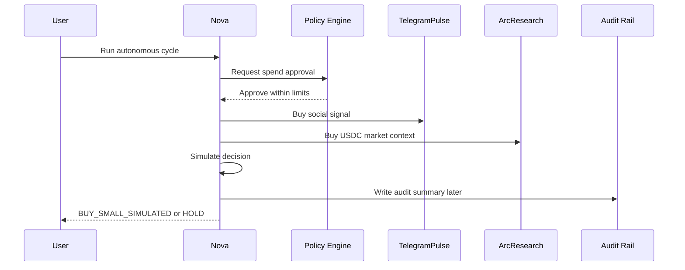

# Product

## One-liner

Agent Intelligence Market is a control room where autonomous agents buy bounded intelligence before making a simulated market decision.

## User flow

## Non-negotiable product boundaries

- Testnet only.
- No mainnet funds.
- No real swap or trade in MVP.
- Fixtures are allowed only with visible data-mode labeling.
- LLMs can summarize and explain, but cannot approve payments or sign transactions.
