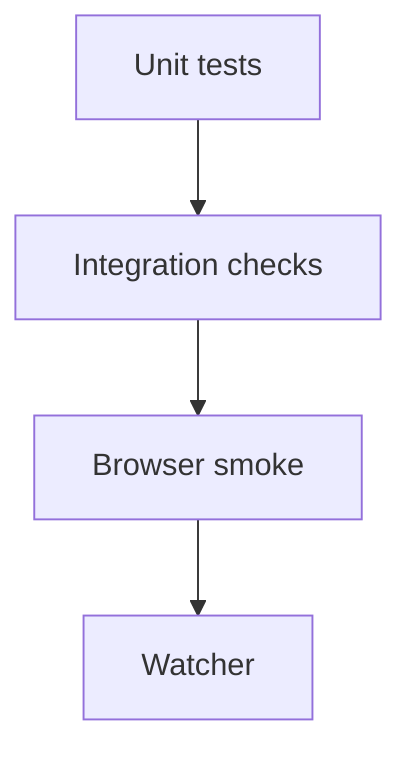

# Testing

## Test pyramid



## Unit tests

- Policy approves valid small spend.
- Policy rejects disabled Reddit provider.
- Policy rejects over-limit spend.
- Policy rejects low confidence.
- Demo cycle does not select Reddit.

## Browser checks

Playwright smoke verifies:

- Hero and control room render.
- Simulated decision is visible.
- Reddit disabled state is visible.
- Mobile viewport still exposes the primary action.
- Status API does not leak secrets.

## Commands

```bash
npm run test
npm run qa:smoke
npm run qa:browser
npm run qa:full
```


## Browser dependency note

`qa:smoke` is a lightweight HTTP smoke test that does not require downloading a browser. `qa:browser` is the full Playwright browser check and needs local Chromium space.
